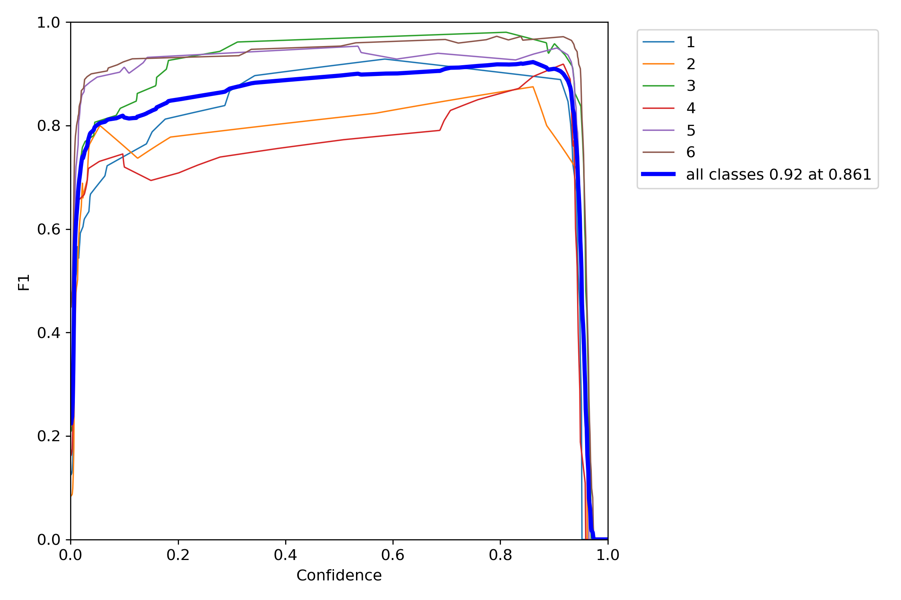
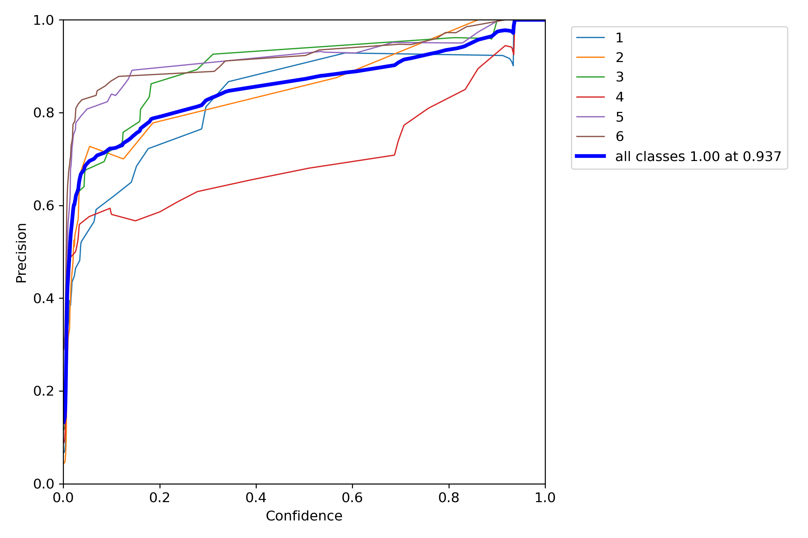
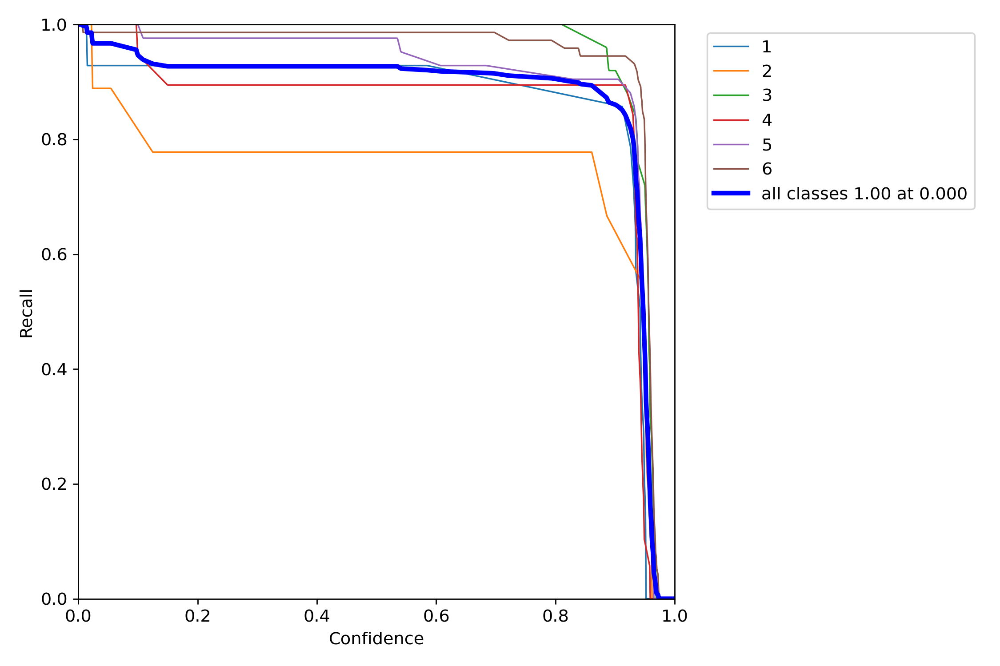

# Dice number recognition

Semestral task for Cognitive Systems course at CTU in Prague.

The goal is to implement a recognition tool for standard 6-sided dice. Ideally inspired by human brain function.

## Runtime


Final implementation uses the well known YOLOv5 neural model. To run, firstly install the requirements.

```sh
$ pip install -r requirements.txt
```

### Running the inference

Then, since I added the trained models to this repository for simplicity, just run the inference:

```sh
$ python yolov5/detect.py --weights best_models/best_medium.pt --source 0 --conf-thres 0.7
```

Then, you can see the full runtime in `yolov5/runs/detect/exp*/0.mp4` folder, (`*` symbolizes a number, depending on how many detections you had)

To run inference on a directory of images (i.e. `Dice-3/test/images/`), run:

```sh
$ python yolov5/detect.py --weights best_models/best_medium.pt --source Dice-3/test/images/ --conf-thres 0.7
```

Then, you can see the inferred images in `yolov5/runs/detect/exp*/` folder, (`*` symbolizes a number, depending on how many detections you had)

### Setup
You can set up the inference confidence treshold using the `--conf-thres` parameter. Decide for the best






